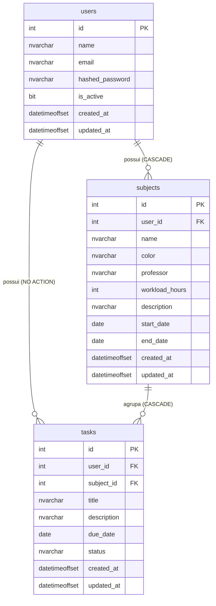

# Dicionário de Dados — EduTrack

> **Estado do projeto:** Outubro de 2026  
> **Banco de dados:** SQLite (desenvolvimento) · SQL Server `EduTrackDB` (produção/entrega)  
> **ORM:** SQLAlchemy 2.x com Alembic para migrações

---

## Sumário

| # | Tabela | Descrição resumida |
|---|--------|--------------------|
| 1 | [users](#1-users) | Usuários cadastrados no sistema |
| 2 | [subjects](#2-subjects) | Disciplinas acadêmicas de cada usuário |
| 3 | [tasks](#3-tasks) | Tarefas vinculadas a uma disciplina |

> [!NOTE]
> As entidades `calendar_events`, `study_sessions` e `materials` foram planejadas como funcionalidades futuras, mas **ainda não possuem tabelas criadas** no banco de dados atual. Elas não constam neste dicionário pois não há código de model implementado.

---

## 1. `users`

**Descrição:** Armazena os dados de cada estudante cadastrado na plataforma. É a entidade central do sistema — todos os outros registros pertencem a um usuário.

### Campos

| Campo | Tipo (SQL Server) | Tipo (Python/ORM) | Obrigatório | Restrições | Descrição |
|-------|-------------------|-------------------|-------------|------------|-----------|
| `id` | `INT IDENTITY(1,1)` | `Integer` | ✅ Sim | **PK** · Auto-incremento | Identificador único do usuário |
| `name` | `NVARCHAR(255)` | `String(255)` | ✅ Sim | NOT NULL | Nome completo do usuário |
| `email` | `NVARCHAR(255)` | `String(255)` | ✅ Sim | NOT NULL · UNIQUE · INDEX | Endereço de e-mail; usado como login |
| `hashed_password` | `NVARCHAR(255)` | `String(255)` | ✅ Sim | NOT NULL | Senha criptografada via BCrypt |
| `is_active` | `BIT` | `Boolean` | ✅ Sim | NOT NULL · DEFAULT `1` | Indica se a conta está ativa (`1`) ou desativada (`0`) |
| `created_at` | `DATETIMEOFFSET` | `DateTime(timezone=True)` | ✅ Sim | NOT NULL · DEFAULT `now()` | Data e hora de criação do registro |
| `updated_at` | `DATETIMEOFFSET` | `DateTime(timezone=True)` | ✅ Sim | NOT NULL · DEFAULT/ON UPDATE `now()` | Data e hora da última atualização |

### Chaves

| Tipo | Nome | Campo(s) |
|------|------|----------|
| Primária (PK) | `PK_users` | `id` |
| Única (UQ) | `UQ_users_email` | `email` |

### Relacionamentos

| Tabela relacionada | Tipo | Campo local | Campo remoto | Comportamento ao deletar |
|--------------------|------|-------------|--------------|--------------------------|
| `subjects` | 1 → N (um usuário tem muitas disciplinas) | `id` | `subjects.user_id` | **CASCADE** — exclui todas as disciplinas do usuário |
| `tasks` | 1 → N (um usuário tem muitas tarefas) | `id` | `tasks.user_id` | **NO ACTION** — mantém tarefas (a cascade vem via subject) |

---

## 2. `subjects`

**Descrição:** Armazena as disciplinas acadêmicas criadas por cada usuário. Serve como agrupador de tarefas e referência para calcular o progresso do estudante.

### Campos

| Campo | Tipo (SQL Server) | Tipo (Python/ORM) | Obrigatório | Restrições | Descrição |
|-------|-------------------|-------------------|-------------|------------|-----------|
| `id` | `INT IDENTITY(1,1)` | `Integer` | ✅ Sim | **PK** · Auto-incremento | Identificador único da disciplina |
| `user_id` | `INT` | `Integer` | ✅ Sim | NOT NULL · **FK** → `users.id` · INDEX | Usuário dono da disciplina |
| `name` | `NVARCHAR(255)` | `String(255)` | ✅ Sim | NOT NULL | Nome da disciplina (ex.: "Cálculo II") |
| `color` | `NVARCHAR(20)` | `String(20)` | ❌ Não | NULL | Cor de destaque no frontend (ex.: `#7C3AED`) |
| `professor` | `NVARCHAR(255)` | `String(255)` | ❌ Não | NULL | Nome do professor responsável |
| `workload_hours` | `INT` | `Integer` | ❌ Não | NULL | Carga horária total da disciplina em horas |
| `description` | `NVARCHAR(1000)` | `String(1000)` | ❌ Não | NULL | Descrição ou ementa resumida da disciplina |
| `start_date` | `DATE` | `Date` | ❌ Não | NULL | Data de início do período letivo |
| `end_date` | `DATE` | `Date` | ❌ Não | NULL | Data de encerramento do período letivo |
| `created_at` | `DATETIMEOFFSET` | `DateTime(timezone=True)` | ✅ Sim | NOT NULL · DEFAULT `now()` | Data e hora de criação do registro |
| `updated_at` | `DATETIMEOFFSET` | `DateTime(timezone=True)` | ✅ Sim | NOT NULL · DEFAULT/ON UPDATE `now()` | Data e hora da última atualização |

### Chaves

| Tipo | Nome | Campo(s) |
|------|------|----------|
| Primária (PK) | `PK_subjects` | `id` |
| Estrangeira (FK) | `FK_subjects_user` | `user_id` → `users.id` |
| Índice | `IX_subjects_user_id` | `user_id` |

### Relacionamentos

| Tabela relacionada | Tipo | Campo local | Campo remoto | Comportamento ao deletar |
|--------------------|------|-------------|--------------|--------------------------|
| `users` | N → 1 (muitas disciplinas pertencem a um usuário) | `user_id` | `users.id` | — |
| `tasks` | 1 → N (uma disciplina tem muitas tarefas) | `id` | `tasks.subject_id` | **CASCADE** — exclui todas as tarefas da disciplina |

---

## 3. `tasks`

**Descrição:** Armazena as tarefas e atividades acadêmicas criadas dentro de uma disciplina. Possui ciclo de vida controlado pelo campo `status`, que é usado pelo Dashboard para calcular o progresso.

### Campos

| Campo | Tipo (SQL Server) | Tipo (Python/ORM) | Obrigatório | Restrições | Descrição |
|-------|-------------------|-------------------|-------------|------------|-----------|
| `id` | `INT IDENTITY(1,1)` | `Integer` | ✅ Sim | **PK** · Auto-incremento | Identificador único da tarefa |
| `user_id` | `INT` | `Integer` | ✅ Sim | NOT NULL · **FK** → `users.id` · INDEX | Usuário dono da tarefa (redundante com `subject_id`, mas facilita queries diretas por usuário) |
| `subject_id` | `INT` | `Integer` | ✅ Sim | NOT NULL · **FK** → `subjects.id` · INDEX | Disciplina à qual a tarefa pertence |
| `title` | `NVARCHAR(255)` | `String(255)` | ✅ Sim | NOT NULL | Título/nome da tarefa |
| `description` | `NVARCHAR(1000)` | `String(1000)` | ❌ Não | NULL | Descrição detalhada ou instruções da tarefa |
| `due_date` | `DATE` | `Date` | ❌ Não | NULL | Data limite de entrega |
| `status` | `NVARCHAR(20)` | `String(20)` | ✅ Sim | NOT NULL · DEFAULT `'pendente'` · CHECK | Estado atual da tarefa. Valores permitidos: `pendente`, `em_andamento`, `concluida` |
| `created_at` | `DATETIMEOFFSET` | `DateTime(timezone=True)` | ✅ Sim | NOT NULL · DEFAULT `now()` | Data e hora de criação do registro |
| `updated_at` | `DATETIMEOFFSET` | `DateTime(timezone=True)` | ✅ Sim | NOT NULL · DEFAULT/ON UPDATE `now()` | Data e hora da última atualização |

### Chaves

| Tipo | Nome | Campo(s) |
|------|------|----------|
| Primária (PK) | `PK_tasks` | `id` |
| Estrangeira (FK) | `FK_tasks_user` | `user_id` → `users.id` |
| Estrangeira (FK) | `FK_tasks_subject` | `subject_id` → `subjects.id` |
| Índice | `IX_tasks_user_id` | `user_id` |
| Índice | `IX_tasks_subject_id` | `subject_id` |
| Check | `CK_tasks_status` | `status IN ('pendente', 'em_andamento', 'concluida')` |

### Relacionamentos

| Tabela relacionada | Tipo | Campo local | Campo remoto | Comportamento ao deletar |
|--------------------|------|-------------|--------------|--------------------------|
| `users` | N → 1 (muitas tarefas pertencem a um usuário) | `user_id` | `users.id` | NO ACTION |
| `subjects` | N → 1 (muitas tarefas pertencem a uma disciplina) | `subject_id` | `subjects.id` | **CASCADE** — se a disciplina for excluída, todas as tarefas dela são excluídas também |

### Enumeração do campo `status`

| Valor | Significado |
|-------|-------------|
| `pendente` | Tarefa criada mas ainda não iniciada *(valor padrão)* |
| `em_andamento` | Tarefa em execução |
| `concluida` | Tarefa finalizada (contabilizada no progresso da disciplina) |

---

## Diagrama de Relacionamentos (ERD)

---

## Visão Geral das Regras de Cascade

| Ação | Efeito |
|------|--------|
| Excluir um **usuário** | Remove automaticamente todas as suas **disciplinas**, que por sua vez removem todas as **tarefas** de cada disciplina |
| Excluir uma **disciplina** | Remove automaticamente todas as **tarefas** vinculadas a ela |
| Excluir uma **tarefa** | Não afeta outras entidades |

---

## Convenções Adotadas

| Convenção | Regra |
|-----------|-------|
| Nomenclatura de tabelas | Plural, minúsculo com underscore (`snake_case`) |
| Nomenclatura de colunas | `snake_case` em inglês |
| Chave primária | Sempre `id` do tipo inteiro auto-incrementado |
| Chaves estrangeiras | `<tabela_referenciada_no_singular>_id` (ex.: `user_id`, `subject_id`) |
| Auditoria | Todo registro possui `created_at` e `updated_at` com fuso horário |
| Senhas | Nunca armazenadas em texto puro — sempre via BCrypt (`hashed_password`) |

---

*Documento gerado a partir do código-fonte dos models SQLAlchemy do projeto EduTrack.*
